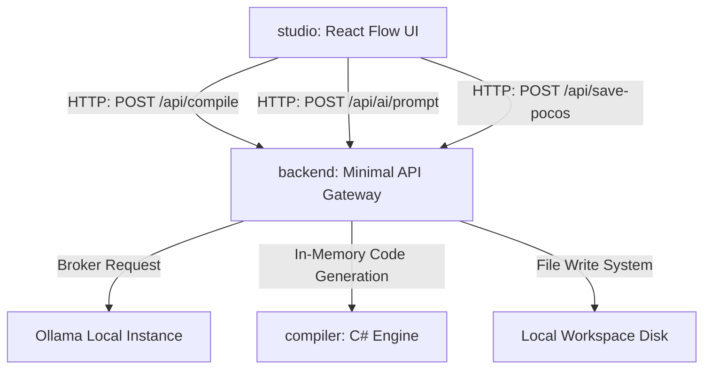

# Developer Reference Guide: Foundry.Schema.Studio

This guide provides a comprehensive overview of the design architecture, visual-to-code data flow, backend API contracts, and guidelines for extending the **Foundry.Schema** visual and compilation workspace.

---

## 1. System Architecture

The project consists of three main components collaborating over HTTP:



### Key Modules:
1. **Frontend Studio (`/studio`):**
   - React + TypeScript Single Page App built using **Vite**.
   - Canvas state is managed via **Zustand** (`store.ts`), coordinating custom Node nodes and orthogonal Edge connectors.
   - Reconciles AI updates visually by matching keys/properties while preserving custom positions.
2. **Integration Backend (`/backend`):**
   - Lightweight **ASP.NET Core Web API** running on .NET 10 (port 5100).
   - Serves as the security broker for writing POCOs directly to the user's local disk, and proxies prompt requests to local LLM instances.
3. **Poco Generation Engine (`/compiler`):**
   - Concrete C# library and console tool that processes JSON Schema into fully attributes-decorated C# records conforming to the `Foundry.Mongo` specifications.

---

## 2. Visual-to-Property Synchronization

UML relationship edges drawn on the canvas are translated into record properties via hooks inside the Zustand store (`store.ts`):

* **Inheritance Edge (`Inheritance`):**
  - Targets the base parent class.
  - Updates the subclass `baseClass` metadata.
  - Generates: `public record Subclass : TargetParent, IVersionable`.
* **Composition Edge (`Composition`):**
  - Creates a container-contained parent-child relation.
  - Automatically injects `List<Target>` collection named `[Target]s` inside the source node.
* **Association Edge (`Association`):**
  - Creates a reference lookup relation.
  - Automatically injects an `ObjectId` property named `[Target]Id` decorated with the `[Indexed]` trait.
* **Sync Cleanup:**
  - Removing a connector edge (via keyboard delete or context tool) intercepts the `'remove'` change in `onEdgesChange` and deletes the corresponding base class target or attribute property from the store.

---

## 3. Backend API Specification

The API gateway boots at `http://localhost:5100` and exposes three core endpoints:

### A. Compile Schema
* **URL:** `/api/compile`
* **Method:** `POST`
* **Content-Type:** `application/json`
* **Request Body:**
  ```json
  {
    "Namespace": "MyNamespace.Domain",
    "Entities": [ ... ],
    "Enums": [ ... ]
  }
  ```
* **Response:** `200 OK` (JSON Map of filename to compiled C# code block strings).

### B. AI Prompt Proxy
* **URL:** `/api/ai/prompt`
* **Method:** `POST`
* **Content-Type:** `application/json`
* **Request Body:**
  ```json
  {
    "Prompt": "Add customer entity with email",
    "CurrentSchema": { ... }
  }
  ```
* **Response:** `200 OK` (Updated JSON Schema brokered and stripped of markdown code fencings from Ollama).

### C. Save POCOs to Workspace
* **URL:** `/api/save-pocos`
* **Method:** `POST`
* **Content-Type:** `application/json`
* **Request Body:**
  ```json
  {
    "Files": {
      "Customer.cs": "using System; ... public record Customer : BaseEntity<ObjectId> {}"
    },
    "OutputPath": "/path/to/my/workspace/Entities"
  }
  ```
* **Response:** `200 OK`
  ```json
  {
    "message": "Successfully saved 1 classes to: /path/to/my/workspace/Entities"
  }
  ```

---

## 4. Extending the System

### Adding New Property Types
To introduce a new property primitive (e.g., `decimal` or `Guid`):
1. **Frontend:** Update the type options in `StudioWorkspace.tsx`:
   ```html
   <select value={prop.type}>
     <option value="Guid">Guid</option>
   </select>
   ```
2. **Backend Compiler:** Add the C# mapping definition inside `PocoGenerator.MapType`:
   ```csharp
   private static string MapType(string schemaType)
   {
       return schemaType.ToLowerInvariant() switch
       {
           "guid" => "Guid",
           ...
       };
   }
   ```

### Customizing the AI Prompts
If you change the model configuration (e.g., shifting from `qwen3-coder` to `llama3`), update the system instructions and markdown code fences cleansing routine inside `backend/Program.cs`:
```csharp
var systemInstructions = "You are a database designer. Respond ONLY with raw JSON...";
```

---

## 5. Rebuilding & Deploying

### Visual UI build
```bash
cd studio
npm install
npm run build
```

### Compiler CLI Pack
To re-pack and update the global CLI command utility:
```bash
dotnet pack compiler/Foundry.Schema.Compiler.csproj
dotnet tool update -g --add-source ./compiler/nupkg Foundry.Schema.Compiler
```
